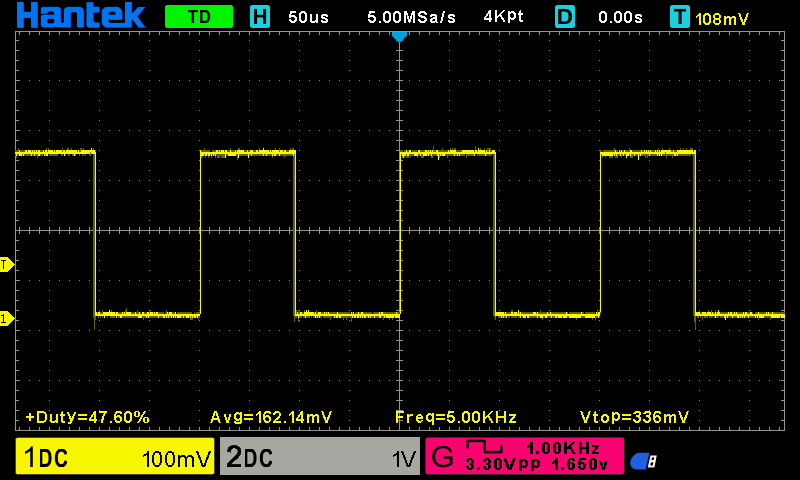

HOW DOES IT WORK?
=================

The BitByteRider RC car is powered by ESP32-C3 Breadboard & Power adapter developmemt board. 
The Schematic and KiCAd PCB board are available on GitHub_: https://github.com/alexandrebobkov/ESP32-C3_Breadboard-Adapter

.. _GitHub: https://github.com/alexandrebobkov/ESP32-C3_Breadboard-Adapter

Reserved Pins & GPIOs
---------------------

The following table summarizes GPIOs and pins reserved for operations purposes.

The GPIO numbers correspond to those on the ESP32-C3 WROOM microcontroller. The Pin number corresponds to the pin on the Breadboard and Power adapter development board.

x- and y- axis
~~~~~~~~~~~~~~

The **GPIO0** and **GPIO1** assigned to measuring the voltage of x- and y- axis of the Joystick. Lastly, there is a group of GPIO pairs responsible for PWM for DC motors.

Direction and Speed
~~~~~~~~~~~~~~~~~~~

The pairs of DC motors on the left side are wired to the dedicated PWM channels. This means that *ESP32-C3 Breadboard DevBoard* can control rotation speed and direction of DC motors in pairs only (i.e. left and right side).
Consequently, only four PWM channels are sufficient for controlling the direction of the RC car. 
Based on this constraint, the RC car can only move front, back, and turn/rotate left and right. Any other movements are not possible (i.e. diagonal or sideways).

.. admonition:: What is PWM?

    **PWM** stands for Pulse Width Modulation. It is a technique used to simulate analog voltage levels using discrete digital signals. It works by 
    rapidly switching a digital GPIO pin between HIGH (on) and LOW (off) states at a fixed frequency (often, at base frequency of 5 kHz). 
    The duty cycle—the percentage of time the signal is HIGH in one cycle determines the effective voltage delivered to a device.

    A higher duty cycle increases the motor speed, and a lower duty cycle decreases the motor speed. This allows for fine-grained speed control 
    without needing analog voltage regulators.

A pair of PWM channels are used per DC motor for defining their rotation speed and direction on each side.
In particular, **GPIO6** and **GPIO5** provide PWM to the left- and right- side DC motors to rotate in a **clockwise** direction.
Similarly, **GPIO4** and **GPIO7** provide PWM to the left- and right- side DC motors to rotate in a **counter-clockwise** direction.
Changing PWM on each channel determines the speed and direction of the RC car.

+-----------+-------+---------------------------------------+----------+
| GPIOs     | State | Description                           | Function |          
+===========+=======+=======================================+==========+
| GPIO6,    | PWM   | Left & Right DC Motors spin           | Forward  |
| GPIO4     |       | clockwise                             |          |
+-----------+-------+---------------------------------------+----------+
| GPIO5,    | PWM   | Left & Right DC Motors spin           | Reverse  |
| GPIO7     |       | counterclockwise                      |          |
+-----------+-------+---------------------------------------+----------+
| GPIO6,    | PWM   | Left DC Motors spin clockwise.        | Left     |
| GPIO7     |       | Right DC Motors spin counterclockwise |          |
+-----------+-------+---------------------------------------+----------+
| GPIO4,    | PWM   | Left DC Motors spin counterclockwise. | Right    |
| GPIO5     |       | Right DC Motors spin clockwise        |          |
+-----------+-------+---------------------------------------+----------+

The following images illustrate various PWM duty cycles registered by oscilloscope (duty cycles 0%, 48% and 91%, resp.).

.. figure:: _static/ESP-IDF_Robot_PWM_Duty-0.bmp

    DC Motor PWM duty cycle 0%

    DC Motor PWM duty cycle 47.6%

    
    DC Motor PWM duty cycle 90.8%

.. raw:: html

       

+------+-----+---------------------------------------------------------+----------------+
| GPIO | Pin | Function                                                | Notes          |
+======+=====+=========================================================+================+
| 0    | 16  | Joystick x-axis                                         | ADC1_CH0       |
+------+-----+---------------------------------------------------------+----------------+
| 1    | 15  | Joystick y-axis                                         | ADC1_CH1       |
+------+-----+---------------------------------------------------------+----------------+
| 8    | 5   | Joystick push button                                    |                |
+------+-----+---------------------------------------------------------+----------------+
| 6    | 4   | PWM for clockwise rotation of left-side motors          | LEDC_CHANNEL_1 |
+------+-----+---------------------------------------------------------+----------------+
| 5    | 3   | PWM for clockwise rotation of right-side motors         | LEDC_CHANNEL_0 |
+------+-----+---------------------------------------------------------+----------------+
| 4    | 2   | PWM for counter-clockwise rotation of right-side motors | LEDC_CHANNEL_2 |
+------+-----+---------------------------------------------------------+----------------+
| 7    | 6   | PWM for counter-clockwise rotation of left-side motors  | LEDC_CHANNEL_3 |
+------+-----+---------------------------------------------------------+----------------+

Fusion of Software with Hardware
--------------------------------

The *struct* for storing motors PWM values.

.. code-block:: c

    struct motors_rpm {
        int motor1_rpm_pwm;
        int motor2_rpm_pwm;
        int motor3_rpm_pwm;
        int motor4_rpm_pwm;
    };

The function for updating motors' PWM values.

.. code-block:: c

    // Function to send data to the receiver
    void sendData (void) {
        sensors_data_t buffer;              // Declare data struct

        buffer.crc = 0;
        buffer.x_axis = 0;
        buffer.y_axis = 0;
        buffer.nav_bttn = 0;
        buffer.motor1_rpm_pwm = 0;
        buffer.motor2_rpm_pwm = 0;
        buffer.motor3_rpm_pwm = 0;
        buffer.motor4_rpm_pwm = 0;

        // Display brief summary of data being sent.
        ESP_LOGI(TAG, "Joystick (x,y) position ( 0x%04X, 0x%04X )", (uint8_t)buffer.x_axis, (uint8_t)buffer.y_axis);  
        ESP_LOGI(TAG, "pwm 1, pwm 2 [ 0x%04X, 0x%04X ]", (uint8_t)buffer.pwm, (uint8_t)buffer.pwm);
        ESP_LOGI(TAG, "pwm 3, pwm 4 [ 0x%04X, 0x%04X ]", (uint8_t)buffer.pwm, (uint8_t)buffer.pwm);

        // Call ESP-NOW function to send data (MAC address of receiver, pointer to the memory holding data & data length)
        uint8_t result = esp_now_send(receiver_mac, &buffer, sizeof(buffer));

        // If status is NOT OK, display error message and error code (in hexadecimal).
        if (result != 0) {
            ESP_LOGE("ESP-NOW", "Error sending data! Error code: 0x%04X", result);
            deletePeer();
        }
        else
            ESP_LOGW("ESP-NOW", "Data was sent.");
    }

The onDataReceived() and onDataSent() are two call-bacl functions that get evoked on each corresponding event.

.. code-block:: c
    
    // Call-back for the event when data is being received
    void onDataReceived (uint8_t *mac_addr, uint8_t *data, uint8_t data_len) {

        buf = (sensors_data_t*)data;                            // Allocate memory for buffer to store data being received
        ESP_LOGW(TAG, "Data was received");
        ESP_LOGI(TAG, "x-axis: 0x%04x", buf->x_axis);
        ESP_LOGI(TAG, "x-axis: 0x%04x", buf->y_axis);
        ESP_LOGI(TAG, "PWM 1: 0x%04x", buf->motor1_rpm_pwm);
    }

    // Call-back for the event when data is being sent
    void onDataSent (uint8_t *mac_addr, esp_now_send_status_t status) {
        ESP_LOGW(TAG, "Packet send status: 0x%04X", status);
    }

The rc_send_data_task() function runs every 0.1 second to transmit the data to the receiver.

.. code-block:: c

    // Continous, periodic task that sends data.
    static void rc_send_data_task (void *arg) {

        while (true) {
            if (esp_now_is_peer_exist(receiver_mac))
                sendData();
            vTaskDelay (100 / portTICK_PERIOD_MS);
        }
    }

Schematic
---------

.. image:: _static/ESP-IDF_Robot_schematic.png