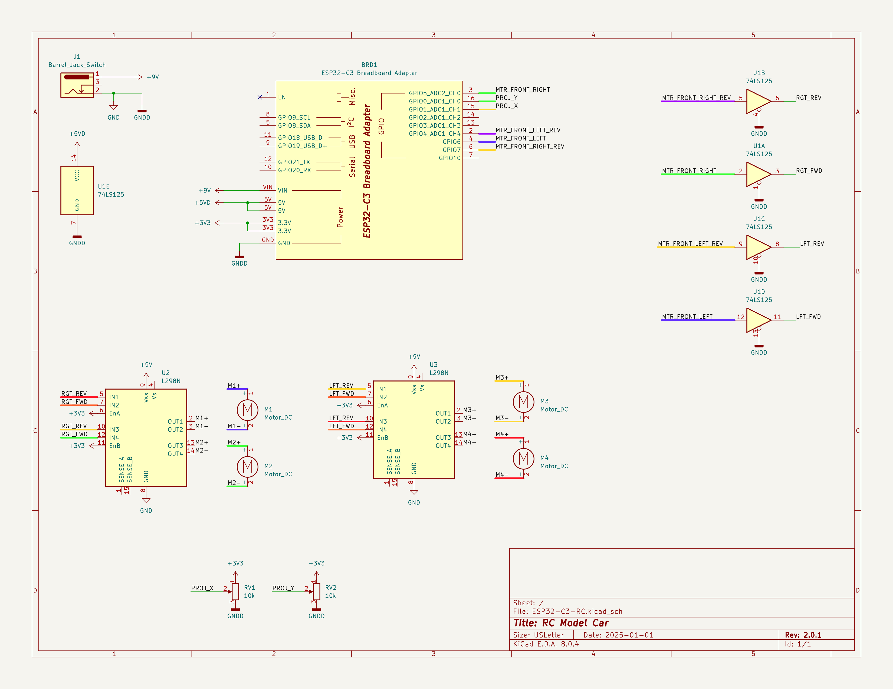

HOW DOES IT WORK?
=================

The BitByteRider RC car is powered by ESP32-C3 Breadboard & Power adapter developmemt board.

Reserver Pins & GPIOs
---------------------

The table below summarizes GPIOs and pins reserved for operations purposes.

+-----------+-----------+-----------+-----------+
| GPIO | Pin | Function  | Notes |
+======+=====+===========+===========+
| 0    | 16  | Joystick x-axis      | ADC1_CH0      |
+------+-----+-----------+-----------+
| 1    | 15  | Joystick y-axis      | ADC1_CH1      |
+------+-----+-----------+-----------+
| 8    | 5   | Joystick push button     | Data      |
+------+-----+-----------+-----------+
| 6    | 4   | PWM for clockwise rotation of left-side motors     | LEDC_CHANNEL_1      |
+------+-----+-----------+-----------+
| 5    | 3   | PWM for clockwise rotation of right-side motors     | LEDC_CHANNEL_0      |
+------+-----+-----------+-----------+
| 4    | 2   | PWM for counter-clockwise rotation of right-side motors      | LEDC_CHANNEL_2      |
+------+-----+-----------+-----------+
| 7    | 6   | PWM for counter-clockwise rotation of left-side motors      | LEDC_CHANNEL_3      |
+------+-----+-----------+-----------+

Schematic
---------

